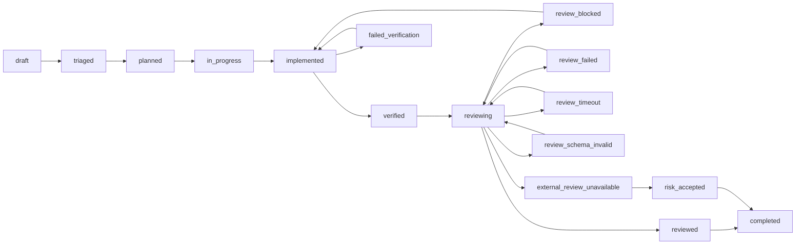
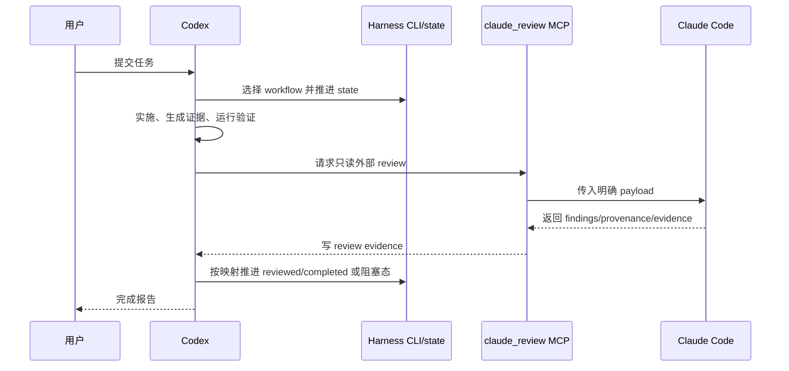

# 项目总览

本文档是 `ai-coding-harness` 的正式项目索引视图，基线为 v0.2.1 reviewer provenance hardening closure。

## 入口

| 入口 | 用途 |
| --- | --- |
| `AGENTS.md` | Codex 入口规则、读取顺序、核心不变量、完成报告要求 |
| `README.md` | 中文项目说明、快速开始、当前脚手架状态 |
| `docs/INDEX.md` | 文档索引 |
| `harness/memory/progress.md` | 当前发布/推进状态 |

## 核心结构

```mermaid
flowchart TD
    Root["ai-coding-harness"]
    Root --> Agents["AGENTS.md"]
    Root --> Docs["docs/"]
    Root --> Harness["harness/"]
    Root --> MCP["mcp/claude-review/"]
    Root --> Tests["tests/"]

    Harness --> Core["core/"]
    Harness --> Adapters["adapters/"]
    Harness --> Templates["templates/"]
    Harness --> Schemas["schemas/"]
    Harness --> Memory["memory/"]
    Harness --> Runs["runs/"]
    Harness --> CLI["cli.py"]

    Core --> State["state-authority.md"]
    Core --> Triage["task-triage.md"]
    Core --> Lifecycle["lifecycle.md"]
    Core --> Delegation["delegation.md"]
    Core --> Verification["verification.md"]
    Core --> MemoryRules["memory.md"]
    Core --> Safety["safety.md"]

    Adapters --> Codex["codex.md"]
    Adapters --> Claude["claude-code.md"]
    Adapters --> Generic["generic-cli-agent.md"]

    MCP --> Server["server.py"]
    MCP --> Adapter["adapter.py"]
    MCP --> Schema["schema/"]

    Docs --> Index["INDEX.md"]
    Docs --> Specs["superpowers/specs/"]
    Docs --> Plans["superpowers/plans/"]
    Docs --> Overview["project-overview.md"]

    Tests --> StateTests["state schema / CLI / contracts"]
    Tests --> AdapterTests["claude review adapter"]
```



## 生命周期

来源：`harness/core/state-authority.md`、`harness/core/lifecycle.md`、`harness/cli.py`。



## 分流规则

| Track | 适用范围 | 已注册 workflow |
| --- | --- | --- |
| Fast | 小型文档、格式、低风险小改 | `fast-doc-change`, `fast-code-change` |
| Standard | 常规代码、文档系统、适配器、schema | `standard-doc-system-change`, `standard-code-change`, `standard-agent-adapter-change` |
| Strict | 凭据、生产配置、权限、安全、删除、不可逆变更 | `strict-risk-change`, `strict-destructive-change` |

## Agent 边界



核心不变量：

- Harness 定义有效 workflow，Codex 选择并执行。
- Codex 可以更新当前 run state，外部 agent 只能返回证据。
- Claude Code 在 v0.1/v0.2 路径中是只读 reviewer。
- 没有验证证据，不允许声明完成。
- 严格 workflow 偏离必须先获得用户确认。

## v0.2.1 发布状态

v0.2.1 reviewer provenance hardening 已合入 `master` 并推送到 `origin/master`。当前闭环记录：

- 进度记忆：`harness/memory/progress.md`
- hardening 计划：`docs/superpowers/plans/2026-06-19-v0.2.1-reviewer-provenance-hardening.md`
- 实施 run：`harness/runs/2026-06-19-v0.2-reviewer-provenance-implementation/`

## XMind Artifact

可编辑脑图位于：

```text
docs/xmind/ai-coding-harness.xmind
```

生成脚本：

```text
python scripts/gen_xmind.py
```
